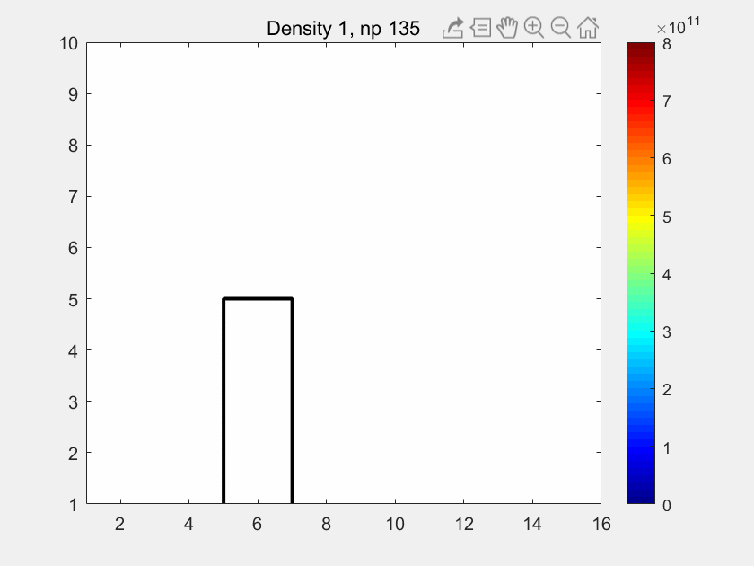

A demo for the particle in cell (PIC) method in 2D domain.

As shown in the following picture, the plasma inject from the left, and there is a plate on the bottom with a constant potential. The maximum number of  injection particle is 2000.

Reference:

1. https://upcommons.upc.edu/bitstream/handle/2117/96109/TXSP1de1.pdf, Chapter 3, which describing 4 steps in PIC methods

2. https://www.particleincell.com/2010/es-pic-method/; https://www.particleincell.com/2011/particle-in-cell-example/; https://www.particleincell.com/2011/finite-difference-method/ implement the PIC method in detail
3. https://zpic-plasma.github.io/about/pic
